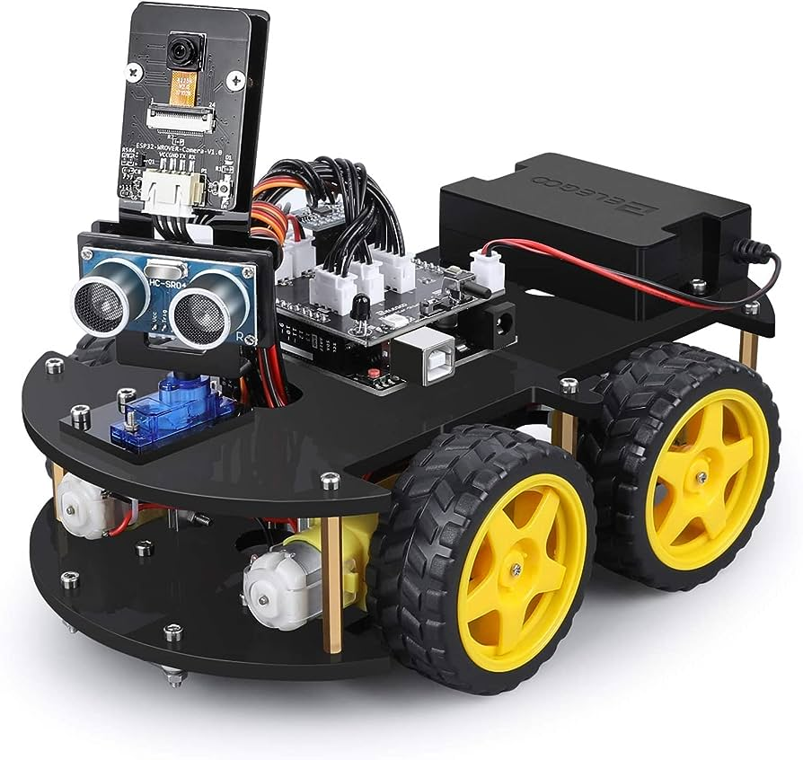
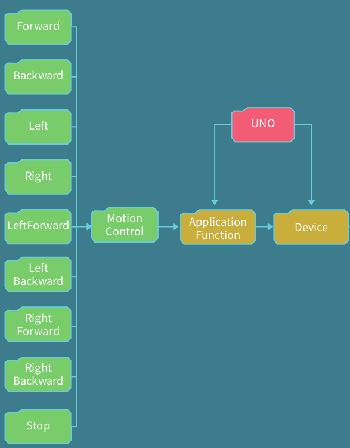

# Project `aserial`
My first Arduino project.
```
/*********************************************************/
    _    ____  _____ ____  ___    _    _     
   / \  / ___|| ____|  _ \|_ _|  / \  | |    
  / _ \ \___ \|  _| | |_) || |  / _ \ | |    
 / ___ \ ___) | |___|  _ < | | / ___ \| |___ 
/_/   \_\____/|_____|_| \_\___/_/   \_\_____|

-> Description: Implementation of SmartCar v4.0
-> Version: 1.1.0
-> Author: Vittorio Tiozzo
-> Tutor: Angelo Damante
-> Framework: Arduino
-> Platform: PlatformIO
/*********************************************************/
```

## Platform
<p align="center">
    
</p>
 
- arduino uno
- mpu6050
- esp32
- battery module
- 4 dc motor
- shield expansion board to handle motors
- camera
- ultrasonic sensor
- linetracking

## Directories Layout
Following platformIO rules, the directories layout is shown below
```
smart-car-arduino
├── include
│ ├── definitions.h
│ ├── demo_libraries.h
│ ├── moves.h
│ └── README
├── lib
│ ├── MotorDriver
│ ├── README
│ └── UltrasonicSensor
├── platformio.ini
├── README.md
├── src
│ ├── main.cpp
│ └── moves.cpp
└── test
    └── README
```

## Control
My goal is to implement control interface to use joystick or smartphone app.

### Moves
In the `moves.h` file are defined follow instructions.
<p align="center">
    
</p>

### Joystick
`TODO`